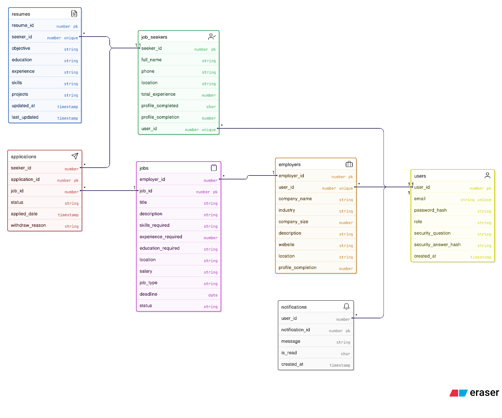

# RevHire – Console-Based Job Portal Application

RevHire is a **Java-based console application** that connects **Job Seekers** and **Employers** on a single platform.  
Job seekers can build resumes, search and apply for jobs, while employers can post jobs, manage applications, and shortlist or reject candidates.

The project follows a **layered architecture (DAO–Service–UI)** and is designed to be **scalable** for future conversion into a **web or microservices-based application**.

---

## 📌 Application Overview

**RevHire** provides a real-world simulation of a job portal system with:
- Role-based access (Job Seeker / Employer)
- Secure authentication
- Resume management
- Job posting and application workflow
- Notification system

---

## 🧑‍💼 Job Seeker Features

- Register & Login
- Create and manage profile
- Build structured textual resume:
    - Objective
    - Education
    - Experience
    - Skills
    - Projects
- Search jobs using filters:
    - Job role
    - Location
    - Experience
    - Company name
    - Salary range
    - Job type
- Apply for jobs (one-click)
- View applied jobs with status:
    - Applied
    - Shortlisted
    - Rejected
    - Withdrawn
- Withdraw applications
- Receive in-app notifications for:
    - Application status updates
    - Job matches

---

## 🏢 Employer Features

- Register company & login
- Create job postings with:
    - Title
    - Description
    - Skills
    - Experience
    - Education
    - Location
    - Salary
    - Job type
    - Deadline
- Manage job postings:
    - View
    - Edit
    - Close / Reopen
    - Delete
- View applicants for each job
- Shortlist / Reject applications
- Manage company profile
- Receive notifications for new applications

---

## 🔐 Authentication & Account Management

- Role-based registration (Job Seeker / Employer)
- Secure login using hashed passwords
- Change password (with current password validation)
- Forgot password recovery using security questions
- Profile completion tracking

---

## 🔔 Notification System

- In-app notifications for:
    - Application status changes
    - New job applications
    - Job-related updates

---

## 🧱 Project Architecture

UI (Console)
↓
Service Layer
↓
DAO Layer
↓
Database (JDBC)


- **DAO Layer**: Handles database operations
- **Service Layer**: Business logic
- **UI Layer**: Console-based user interaction
- **Util Package**: DB connection, hashing, helpers
- **Log4j**: Centralized logging (file-based)

---

## 📂 Project Structure
``````
RevHire
│
├── src
│   ├── main
│   │   ├── java
│   │   │   └── com.revhare
│   │   │       ├── dao
│   │   │       │   ├── impl
│   │   │       │   │   ├── ApplicationsDAOImpl.java
│   │   │       │   │   ├── EmployersDAOImpl.java
│   │   │       │   │   ├── JobsDAOImpl.java
│   │   │       │   │   ├── JobSeekersDAOImpl.java
│   │   │       │   │   ├── NotificationsDAOImpl.java
│   │   │       │   │   ├── ResumesDAOImpl.java
│   │   │       │   │   └── UserDAOImpl.java
│   │   │       │   ├── ApplicationsDAO.java
│   │   │       │   ├── EmployersDAO.java
│   │   │       │   ├── JobsDAO.java
│   │   │       │   ├── JobSeekersDAO.java
│   │   │       │   ├── NotificationsDAO.java
│   │   │       │   ├── ResumesDAO.java
│   │   │       │   └── UserDAO.java
│   │   │       │
│   │   │       ├── model
│   │   │       │   ├── Application.java
│   │   │       │   ├── Employer.java
│   │   │       │   ├── Job.java
│   │   │       │   ├── JobSeeker.java
│   │   │       │   ├── Notification.java
│   │   │       │   ├── Resume.java
│   │   │       │   └── User.java
│   │   │       │
│   │   │       ├── service
│   │   │       │   ├── impl
│   │   │       │   │   ├── ApplicationServiceImpl.java
│   │   │       │   │   ├── EmployersServiceImpl.java
│   │   │       │   │   ├── JobSeekersImpl.java
│   │   │       │   │   ├── JobServiceImpl.java
│   │   │       │   │   ├── NotificationsServiceImpl.java
│   │   │       │   │   ├── ResumeServiceImpl.java
│   │   │       │   │   ├── UserServiceImpl.java
│   │   │       │   ├── ApplicationsService.java
│   │   │       │   ├── EmployersService.java
│   │   │       │   ├── JobSeekersService.java
│   │   │       │   ├── JobService.java
│   │   │       │   ├── NotificationsService.java
│   │   │       │   ├── ResumeService.java
│   │   │       │   └── UserService.java
│   │   │       │
│   │   │       └── util
│   │   │           ├── DBConnection.java
│   │   │           ├── HashUtil.java
│   │   │           └── ProfileUtil.java
│   │   └── resource
│   │         └── log4j2.xml
│   └── test
│        └── java
│            └── com.revhare
│                ├── model
│                │   ├── Application.java
│                │   ├── Employer.java
│                │   ├── Job.java
│                │   ├── JobSeeker.java
│                │   ├── Notification.java
│                │   ├── Resume.java
│                │   └── User.java
│                │
│                └── service
│                    ├── ApplicationsTest.java
│                    ├── EmployersTest.java
│                    ├── JobSeekersTest.java
│                    ├── JobTest.java
│                    ├── NotificationsTest.java
│                    ├── ResumeTest.java
│                    └── UserTest.java
└──pom.xml
```
---

## 🗃️ ER Diagram (Database Design)


---

## 🛠️ Technologies Used

- **Java**
- **JDBC**
- **Oracle / MySQL**
- **Log4j2**
- **JUnit**
- **Git**

---

## 📝 Logging

- Log4j2 configured
- Logs are written **only to log files**
- No console logging
- Log file location: `/logs/application.log`

---

## ▶️ How to Run

1. Clone the repository
2. Configure database in `DBConnection.java`
3. Run SQL scripts to create tables
4. Execute `Main.java`
5. Use console menu for navigation

---

## 🎥 Demo Video

📺 **YouTube Demo**:   
[Watch Here](Link_Here)


---

## 📌 Future Enhancements

- Web-based UI (Spring Boot)
- REST APIs
- JWT Authentication
- Resume upload (PDF)
- Advanced job recommendations
- Microservices architecture

---

## 👤 Author

**Ameer Shaikh**  
Java | JDBC | Log4j | Backend Development

---


